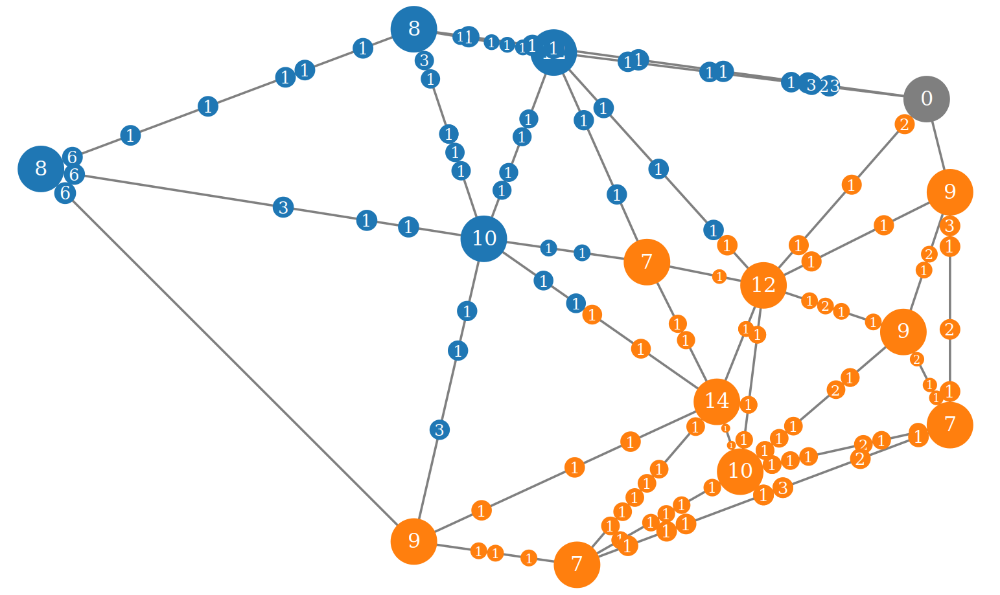

# Badass Battle Bots

We are Zeus WPI. We like games. We like programming. So we decided to build our
very own programming game. Now, we would like to share. Welcome to Badass Battle
Bots.

The objective of the game is to write a computer program that will take on other
competitors' programs in a grand battle for honour, glory and world domination.
Sounds exciting? You bet it is!

We are working hard to create a game that is exciting yet very simple, so that
anyone with minimal coding skills can participate.

So, what can you expect? There will be a series of codenights where we kindly
invite you to exchange strategies with your peers, get some assistance when
you are stuck, trash-talk your opponents, or compete in a preliminary tournament
to show your strength. We will top this off with a grand tournament, where you
will see the action unfold before your eyes. There will be prizes.

# Ready to start coding?

Start by reading [the rules](rules) and you're on your way!
